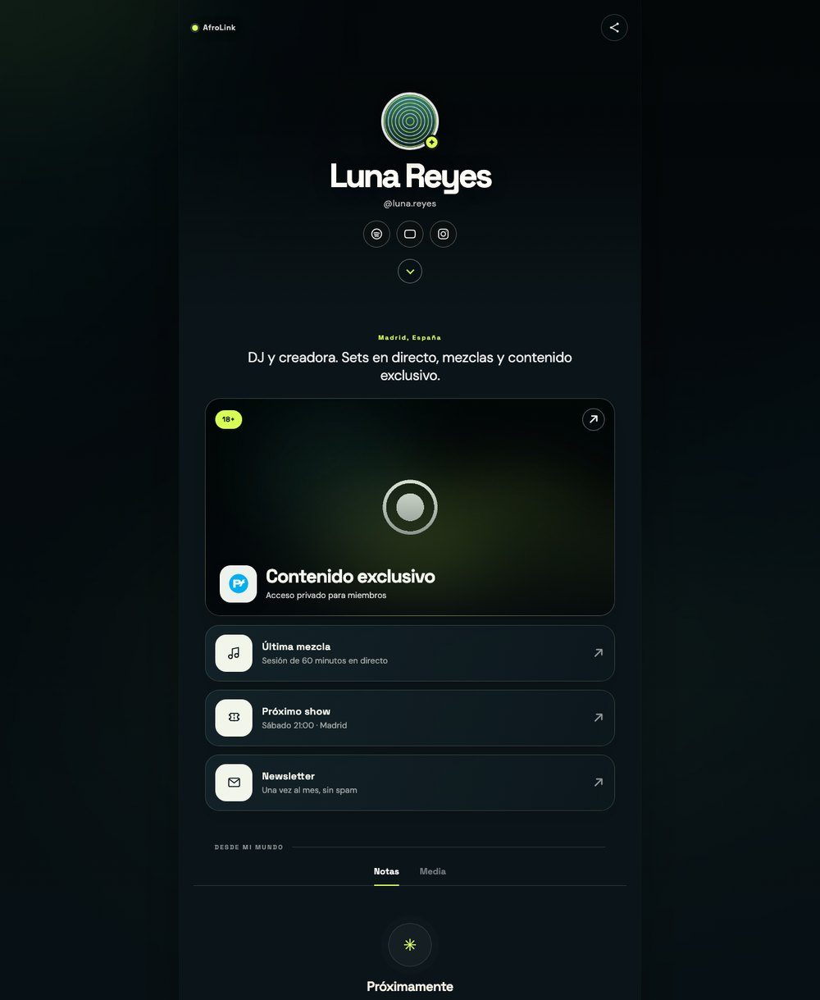
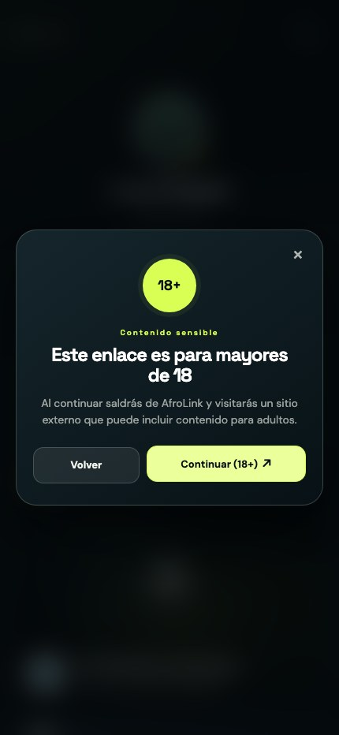

> **Demo build.** This is the public, sanitized copy of the project: the profiles and the imagery it
> ships with (`Luna Reyes` and `assets/img/demo-*`) are fictional. The real registry and photos stay in a
> private repository.

# AfroLink

AfroLink is a link-in-bio platform for creators. Every profile is a plain JavaScript object that is rendered into a fast, self-contained page at `example.com/<slug>`. Pages are pre-rendered at build time, so they ship as real static HTML with their own canonical URL, Open Graph cards and structured data — no framework, no runtime dependencies and no server.

<p>
  
  
  
  
  
  
</p>



## Highlights

- **Data-first profiles.** Content is decoupled from layout: a profile is an entry in [`data/profiles.js`](data/profiles.js) and [`src/render.js`](src/render.js) turns it into markup. Editing a bio never means touching HTML.
- **Pre-rendered, not client-side.** `npm run build` writes one page per profile with `<title>`, `description`, `canonical`, Open Graph and `Person` JSON-LD already in the file, so crawlers that never execute JavaScript still see the real thing.
- **One template, no duplication.** [`src/template.html`](src/template.html) is the only markup in the repository. Root page, profile pages and the 404 fallback are generated from it.
- **Backend-ready by design.** Pages are static today, but the data layer is a single function: swapping `loadProfile()` in [`src/app.js`](src/app.js) for an API call is the whole migration.
- **Sensitive links are gated — and cannot be bypassed.** A card flagged `sensitive: true` renders as a `<button>`, not a link, so middle-click, "open in new tab" and the context menu all go through the 18+ dialog.
- **Nothing is trusted.** Every URL is validated (`javascript:`, `data:` and friends are dropped) and every string that reaches the DOM is escaped, so user-generated profiles can be served safely.
- **Zero dependencies.** No framework, no bundler, no `node_modules`: the build script is plain Node, and the only tooling is `git` and Node 18+.
- **Accessible interactions.** `aria-modal` dialog with Escape support, `aria-live` toast, labelled icon buttons and a `prefers-reduced-motion` fallback.
- **Verified in CI.** [`tests/site.test.mjs`](tests/site.test.mjs) covers the helpers, the escaping, the sensitive-card markup and every generated page.

## Project structure

```
.
├── index.html            # generated: default profile, served at /
├── 404.html              # generated: noindex fallback for unknown paths
├── <slug>/index.html     # generated: one folder per profile
├── src/
│   ├── template.html     # the only hand-written markup
│   ├── styles.css        # design tokens, layout, components
│   ├── app.js            # entry point: re-render when needed + wire the UI
│   ├── render.js         # profile -> view model (used by build and browser)
│   ├── ui.js             # sharing, 18+ gate, tabs, sticky header
│   ├── i18n.js           # page-shell copy per language (es, en)
│   ├── utils.js          # escaping, URL validation, blur parsing
│   ├── icons.js          # inline SVG icon set
│   └── config.js         # site-wide settings
├── data/profiles.js      # the profile registry (swap for the API later)
├── tools/build.mjs       # static page generator
├── tests/site.test.mjs   # dependency-free test suite
├── assets/img/           # avatars, backgrounds, featured images
├── sitemap.xml           # generated: one entry per profile
├── docs/                 # README screenshots
└── CNAME, robots.txt, favicon.svg, .nojekyll, LICENSE
```

Everything marked *generated* is committed on purpose: GitHub Pages serves the repository as-is, so the build output has to be in the branch.

## Quick start

```bash
git clone https://github.com/SergioLorenteDev/afrolink-template
cd afrolink-template
npm run build      # write index.html, 404.html and <slug>/index.html
npm run serve      # python3 -m http.server 4173
```

- Default profile: <http://localhost:4173/>
- A profile page: `http://localhost:4173/<slug>`
- Any profile from any route: `http://localhost:4173/?profile=<slug>`

`npm run verify` runs the build check and the test suite; `npm test` runs the tests alone.

## Adding a profile

1. Add an entry to [`data/profiles.js`](data/profiles.js), for example `luna`.
2. Put the images in `assets/img/` and reference them as `/assets/img/luna-avatar.jpg`.
3. Run `npm run build` — it writes `luna/index.html`, adds the slug to `sitemap.xml` and removes folders for profiles that no longer exist.
4. Commit the registry change **and** the generated pages, then push. The profile is live at `https://example.com/luna`.

A minimal entry looks like this:

```js
luna: {
  name: "Luna Reyes",
  handle: "@luna.reyes",
  lang: "es",
  location: "Madrid, España",
  bio: "DJ y creadora. Sets en directo, mezclas y contenido exclusivo.",
  seoDescription: "Todos los enlaces de Luna Reyes.",
  avatar: "/assets/img/luna-avatar.jpg",
  background: "/assets/img/luna-bg.jpg",
  backgroundBlur: "18%",
  accent: "#d9ff55",
  social: [{ label: "Spotify", kind: "spotify", url: "https://open.spotify.com/" }],
  links: [{ title: "Última mezcla", note: "60 minutos en directo", kind: "music", url: "https://soundcloud.com/" }],
  emptyNotes: "Las notas de Luna aparecerán aquí.",
  emptyMedia: "Las fotos y vídeos de Luna aparecerán aquí.",
},
```

## Profile reference

| Field | Type | Notes |
| --- | --- | --- |
| `name` | string | Display name; used for the title, the avatar `alt` and the JSON-LD. |
| `handle` | string | Shown under the name, e.g. `@luna.reyes`. |
| `lang` | string | Language of the page: sets `<html lang>` and picks the shell copy (labels, tabs, 18+ dialog) from [`src/i18n.js`](src/i18n.js). `es` or `en`; defaults to `es`. |
| `location` | string | Optional eyebrow above the links; hidden when empty. |
| `bio` | string | Optional large text above the links. |
| `seoDescription` | string | Meta description; falls back to `bio`. |
| `avatar` | string | Local path or absolute URL. |
| `background` | string | Full-page background, blurred behind the content. |
| `backgroundBlur` | string | `"15%"` or `"6px"` (100% = 42px). |
| `backgroundPosition` | string | CSS `background-position`, e.g. `"center 35%"`. |
| `accent` / `accentDeep` | string | Accent colours; defaults `#d9ff55` / `#7d9d1b`. |
| `social` | array | `{ label, kind, url, seo? }` icon row. `seo: false` keeps an entry out of the JSON-LD. |
| `featuredLink` | object | Large hero card: `{ title, note, kind, image, url, sensitive? }`. |
| `links` | array | `{ title, note?, kind?, image?, url, sensitive? }` list items. |
| `emptyNotes` / `emptyMedia` | string | Copy for the "Notas" and "Media" tabs while they are empty. |

Icon kinds: `onlyfans`, `telegram`, `instagram`, `x`, `youtube`, `spotify`, `mail`, `spark`, `music`, `ticket`, `heart`, `link`. Unknown kinds fall back to `link`.

## Sensitive links



```js
featuredLink: {
  title: "Contenido exclusivo",
  note: "Acceso privado para miembros",
  kind: "onlyfans",
  sensitive: true,          // renders the 18+ badge and opens the age gate
  image: "/assets/img/luna-featured.jpg",
  url: "https://onlyfans.com/",
}
```

The card is rendered as a button with the destination in `data-sensitive-url`, so there is no `href` to open in a new tab: the only way out is the 18+ dialog. The same flag works on any entry in `links`.

Neutral public wording does not guarantee that Instagram or any other platform approves a link: the image, the destination and how you promote it also have to comply with Meta's policies. Always review the [Meta safety policies](https://www.meta.com/safety/topics/safety-basics/policies/) before publishing.

## How the build works

`tools/build.mjs` imports the registry and the view model, fills [`src/template.html`](src/template.html) and writes:

| Output | Profile | Canonical | Robots |
| --- | --- | --- | --- |
| `index.html` | `DEFAULT_SLUG` | `https://example.com/` | `index,follow` |
| `<slug>/index.html` | each registry entry | `https://example.com/<slug>` | `index,follow` |
| `404.html` | `DEFAULT_SLUG` | `https://example.com/` | `noindex,follow` |
| `sitemap.xml` | every registry entry | — | — |

The build is deterministic and fails if a token has no value; `node tools/build.mjs --check` exits non-zero when the committed pages are stale, which is what CI runs. Generated files start with `<!-- generated by tools/build.mjs -->`, and the build deletes folders that carry that marker but are no longer in the registry.

In the browser, `src/app.js` compares the pre-rendered slug with the one in the URL. If they match it only wires the interactions; if they differ (the `?profile=` variant) it re-renders from the same view model. Unknown slugs keep the default profile on screen but are served as `noindex` so they never compete with real pages.

## Deploying to GitHub Pages

1. Push this repository to GitHub.
2. `Settings → Pages` → `Deploy from a branch` → `main` → `/ (root)`.
3. Keep `CNAME` with `example.com`.
4. At your DNS provider, point `www` with a `CNAME` to `SergioLorenteDev.github.io`. For the apex domain, add the four GitHub Pages `A` records: `185.199.108.153`, `185.199.109.153`, `185.199.110.153`, `185.199.111.153`.
5. Enable `Enforce HTTPS` once the certificate is issued.

`.nojekyll` keeps GitHub from post-processing the files, and `robots.txt` + `sitemap.xml` hand the crawlers a clean map. The deployment assumes a domain root (`example.com`) because the pages use absolute paths such as `/src/styles.css` and `/assets/img/…`. To host it under `SergioLorenteDev.github.io/repositorio`, change `SITE.origin` in [`src/config.js`](src/config.js) and switch the absolute paths to relative ones in the template and the registry.

## Responsive by default

<p>
  
</p>

## Roadmap

The front end is deliberately stateless so the backend can be added without a rewrite.

- [ ] **Profiles API** — `GET /api/profiles/:slug`, consumed by `loadProfile()`.
- [ ] **Server-side rendering** — reuse `src/render.js` to render on request instead of at build time, so a new profile needs no commit.
- [ ] **Accounts and dashboard** — sign up, claim a slug, edit links from the browser.
- [ ] **Click analytics** — per-link counters, referrers and CTR.
- [ ] **Notes and Media tabs** — turn the current empty states into real content types.
- [ ] **Themes** — accent, layout and typography presets per profile.
- [ ] **Custom domains** — map `creador.com` to a profile.
- [ ] **Image pipeline** — resize and convert uploads to AVIF/WebP on the way in.
- [ ] **Language switch** — one profile serving `es` and `en` from the same registry entry.
- [ ] **Moderation and reporting** — required as soon as profiles are user-generated.

## Conventions

Commits follow [Conventional Commits](https://www.conventionalcommits.org/): `feat(ui):`, `fix(seo):`, `docs:`, `chore:`. Keep the subject in the imperative mood and under ~72 characters. Run `npm run verify` before pushing; CI runs the same two checks.

## License

MIT — see [LICENSE](LICENSE).
